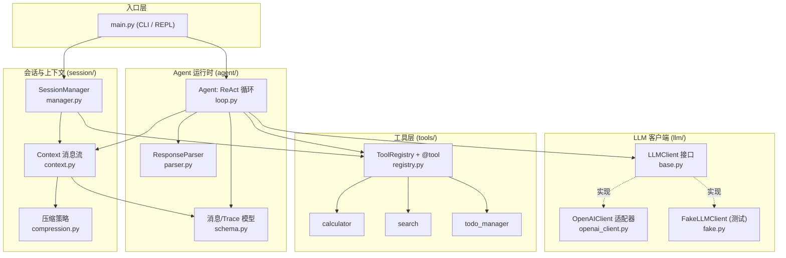
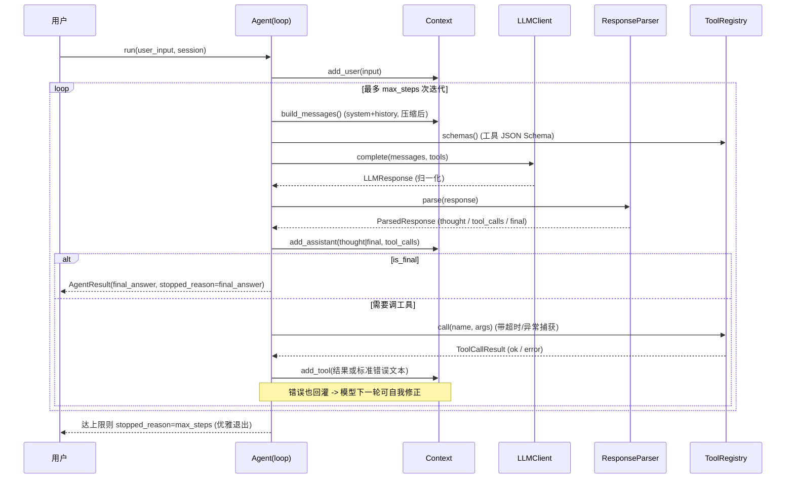
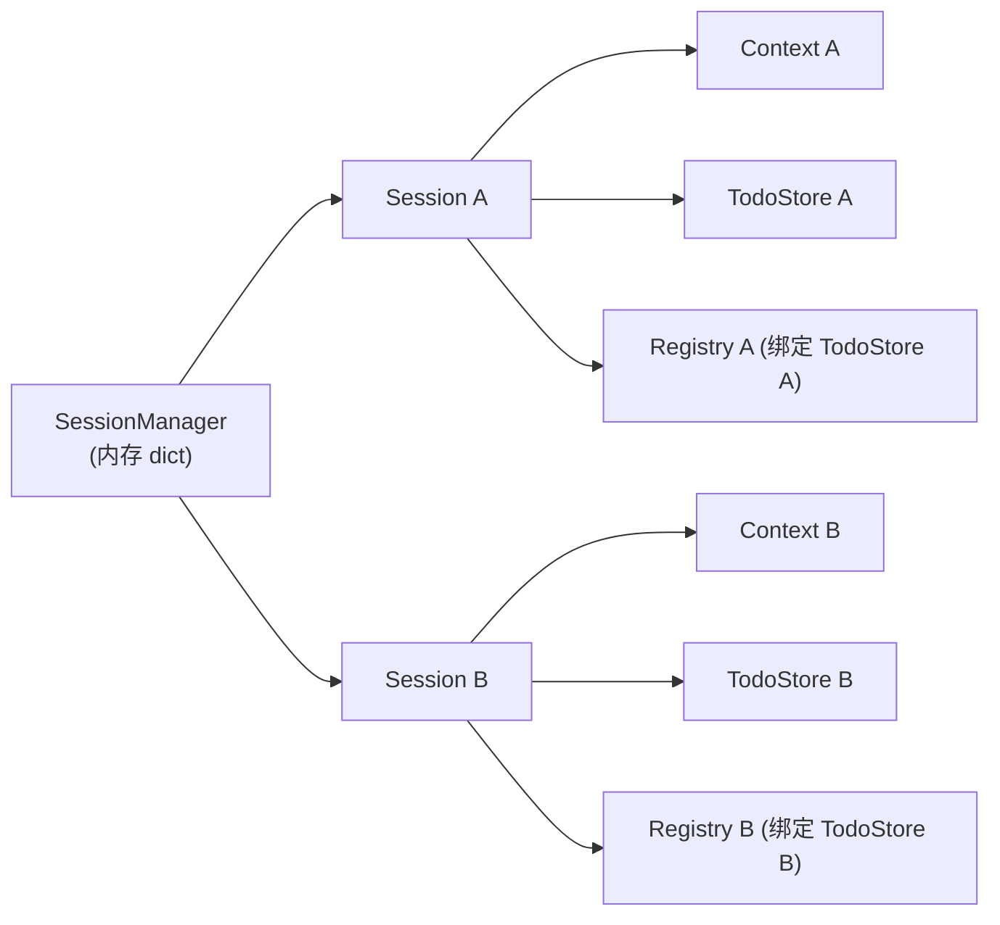
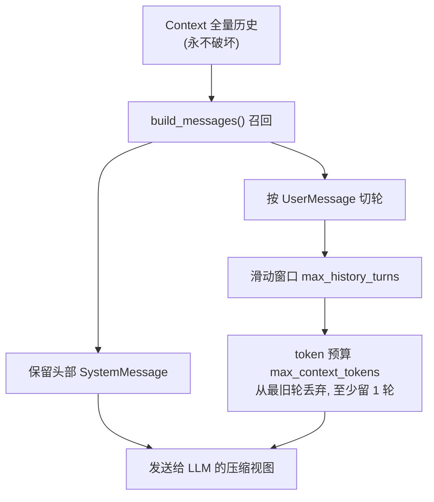

# minimal-agent

一个**零编排框架依赖**的最小可用（MVP）AI Agent 运行时。ReAct 循环、工具注册、Session 与上下文管理全部手写原生代码，仅依赖 `pydantic` 与（可选的）官方 `openai` SDK。

- 不使用 LangChain / LangGraph / LlamaIndex / AutoGen 等任何 Agent 编排框架。
- 支持 OpenAI 兼容协议（OpenAI / DeepSeek / 火山方舟），原生 function-calling 为主、content JSON（ReAct）兜底。
- 全程 `async`，工具执行带超时与异常捕获；内存存储，`pytest` 端到端覆盖，测试**永不触碰真实 LLM**。

---

## 1. 系统架构

### 1.1 分层结构



### 1.2 单轮 ReAct 时序



### 1.3 Session 隔离



每个 `Session` 持有**独立**的 `Context`、`TodoStore`，以及一个绑定该 store 的 `ToolRegistry`。窗口 A「查天气记待办」与窗口 B「写周报」的上下文与待办天然隔离，不会串话。

---

## 2. 快速启动

### 2.1 环境要求

- Python **3.10+**（开发验证于 3.14）
- 依赖：`pydantic>=2`；真实运行需 `openai>=1.0`（`--demo` 离线模式不需要）

### 2.2 安装

```bash
pip install pydantic openai pytest
# 或以可编辑方式安装本项目
pip install -e ".[dev]"
```

### 2.3 离线 demo（无需 API Key，不触网）

先用假客户端验证整条链路跑通：

```bash
python main.py --demo --once "帮我算 (12+8)*3 并记一条待办"
```

输出会流式打印每一步 trace（Step / Thought / Tool Call / Execution Time / Tool Output / Final Answer）：

```
── Step 1 ──────────────────────────────
Thought: 先算数，再记一条待办
Tool Call: calculator({"expression": "(12+8)*3"})
Execution Time: 0.064 ms [ok]
Tool Output: 60
Tool Call: todo_manager({"action": "add", "content": "提交周报"})
Tool Output: {"action": "add", "ok": true, "item": {"id": 1, ...}}
── Step 2 ──────────────────────────────
Tool Call: search({"query": "ReAct agent"})
── Step 3 ──────────────────────────────
Final Answer: 算好了：(12+8)*3 = 60；已记录待办『提交周报』...
```

> Windows 控制台若出现中文乱码，运行前设 `set PYTHONIOENCODING=utf-8`（PowerShell：`$env:PYTHONIOENCODING="utf-8"`）。

### 2.4 接真实 LLM

配置 API Key（三选一环境变量，或用 `--api-key`）：

```bash
# DeepSeek
export OPENAI_API_KEY="sk-xxxx"
python main.py --model deepseek-chat --base-url https://api.deepseek.com

# 火山方舟
export ARK_API_KEY="xxxx"
python main.py --model <your-endpoint-id> --base-url https://ark.cn-beijing.volces.com/api/v3

# OpenAI
export OPENAI_API_KEY="sk-xxxx"
python main.py --model gpt-4o-mini
```

交互模式（多轮对话，支持会话切换）：

```bash
python main.py --model deepseek-chat --base-url https://api.deepseek.com
# [default] > 帮我算 (3+5)*2
# [default] > :session work        # 切到独立会话，待办/上下文互不干扰
# [default] > :sessions            # 列出所有会话
# [default] > :exit
```

### 2.5 常用参数

| 参数 | 说明 | 默认 |
|---|---|---|
| `--once "..."` | 单次提问后退出 | 交互模式 |
| `--demo` | 离线脚本回放，无需 Key | 关 |
| `--model` / `--base-url` / `--api-key` | LLM 端点配置 | `deepseek-chat` |
| `--max-steps` | 单次输入的 ReAct 最大迭代步数（防死循环） | 5 |
| `--max-history-turns` | 上下文滑动窗口保留轮数 | 不限 |
| `--max-context-tokens` | 上下文 token 预算 | 不限 |
| `--system` | 自定义 system prompt | 内置 |
| `--quiet` | 关闭流式 trace，结束时整体打印 | 关 |

---

## 3. Memory 架构详解

这是本项目刻意讲清楚的部分：**上下文里放了什么、什么时候召回、截断压缩放在哪一层。**

### 3.1 Context 里放了哪些信息

`Context`（`session/context.py`）维护一条标准的有序消息流，元素是 `agent/schema.py` 里的四种结构化消息：

| 消息类型 | 内容 | 何时写入 |
|---|---|---|
| `SystemMessage` | 系统提示词（角色设定 + 工具使用约定） | 会话创建时置于**头部** |
| `UserMessage` | 用户每一轮输入 | `Agent.run` 开头 |
| `AssistantMessage` | 模型的思考文本 `content` + 本轮 `tool_calls` | 每次 LLM 响应解析后 |
| `ToolMessage` | 工具执行结果**或标准错误文本**，带 `tool_call_id` 回指对应调用 | 每次工具执行后 |

发送给 LLM 时，每条消息经 `to_dict()` 转成 OpenAI wire-format；`AssistantMessage.tool_calls` 序列化为 `function.arguments` JSON 字符串，`ToolMessage` 通过 `tool_call_id` 与调用配对——顺序严格保证 assistant(tool_calls) 在对应 tool 消息之前。

### 3.2 召回时机

- **每次 LLM 调用前**，`Agent` 调 `Context.build_messages()` 拿到"当轮要发送的上下文视图"。这是唯一的召回点。
- 召回是**非破坏式**的：`Context` 内部始终保留**全量历史**，压缩只作用于「构建发送视图」这一步。因此截断可逆——调大窗口或预算，历史立刻完整回来，不会永久丢失。
- 多轮追问天然串联：第二轮的 `build_messages()` 会带上第一轮的用户输入、工具输出与助手回复，模型据此理解指代（如「那上一轮结果是多少」）。

### 3.3 截断 / 压缩策略放在哪、怎么做

压缩逻辑独立在 `session/compression.py`，由 `Context` 在 `build_messages()` 时调用。策略（对应"保留头部 + 滚动窗口"）：

1. **头部保护**：开头连续的 `SystemMessage` 永不丢弃——系统人设与工具约定必须常驻。
2. **按轮切分**：每条 `UserMessage` 开启一"轮"，其后的 assistant/tool 消息归属同一轮，作为整体保留或丢弃（避免出现有 tool_calls 却丢了 tool 结果的残缺序列）。
3. **滑动窗口**（`max_history_turns`）：只保留最近 N 轮。
4. **token 预算**（`max_context_tokens`）：超出预算时，从**最旧一轮**开始丢弃直到达标；无论如何**至少保留最近一轮**，防止把上下文清空导致死循环。

**token 估算**不引入 tokenizer 依赖：CJK 字符按每字约 1 token、其余按约 4 字符/token 估算（`estimate_tokens`）。这是保守近似，仅用于触发压缩，不追求与真实计费一致。

压缩返回 `CompressionResult`，带 `dropped_turns / dropped_messages / truncated / tokens_before / tokens_after` 统计，便于日志与测试观察。



> **设计取舍**：MVP 只做"截断/滚动窗口"这类基础压缩，不做摘要式记忆（把旧对话压成一段 summary）。后者是自然的演进方向，但会引入额外 LLM 调用与复杂度，超出当前范围。

---

## 4. 项目结构

```
minimal-agent/
├── main.py                  # CLI / REPL 入口，真实 LLM + 离线 demo
├── agent/
│   ├── loop.py              # Agent：ReAct 循环、max_steps、trace 渲染
│   ├── parser.py            # ResponseParser：原生 tool_calls + content JSON 兜底
│   └── schema.py            # 消息类型 + ToolCallTrace/StepTrace/AgentResult
├── llm/
│   ├── base.py              # LLMClient 接口 + LLMResponse/ToolCall 归一化模型
│   ├── openai_client.py     # OpenAI 兼容适配器（懒加载 SDK，可注入 stub）
│   └── fake.py              # FakeLLMClient：脚本回放，测试专用
├── session/
│   ├── manager.py           # Session + SessionManager（内存隔离）
│   ├── context.py           # Context 消息流（非破坏式压缩）
│   └── compression.py       # token 估算 + 滑动窗口/预算截断
├── tools/
│   ├── registry.py          # @tool 装饰器 + ToolRegistry（schema 生成/分发/超时/异常捕获）
│   ├── calculator.py        # ast 白名单安全求值
│   ├── search.py            # mock 知识库检索
│   └── todo.py              # TodoStore + create_todo_tool 工厂
├── tests/                   # 端到端测试（全用 FakeLLMClient，不碰真实 LLM）
└── pyproject.toml
```

---

## 5. 工具层

三个内置工具，通过 `@tool` 装饰器注册，JSON Schema 由类型提示 + docstring 自动推导：

- **`calculator(expression)`**：基于 `ast` 白名单的安全求值（四则/幂/取模/括号 + `sqrt/sin/log` 等函数 + `pi/e`），拒绝属性访问等危险节点，杜绝任意代码执行。
- **`search(query, top_k=3)`**：mock 知识库检索，关键词打分排序，离线可复现。
- **`todo_manager(action, content)`**：可读写的待办清单（add/list/done/clear），状态存于 `TodoStore`，通过工厂绑定到会话以实现隔离。

**异常与超时**：`ToolRegistry.call()` 用 `asyncio.wait_for` 施加超时，捕获所有异常/超时/未知工具/参数错误，统一转成 `ToolCallResult(ok=False, error=...)`，再由 `to_text()` 渲染成 `Error: ...` 回灌给 LLM——**工具报错不会 crash 进程，模型可据此自我修正**。

---

## 6. 测试

```bash
pytest                 # 全量
pytest tests/test_loop.py -v
```

覆盖（66 项，全部离线）：

| 测试文件 | 覆盖点 |
|---|---|
| `test_tools.py` | schema 推导、3 工具 I/O 与错误边界、分发异常/超时/未知工具 |
| `test_parser.py` | 原生 tool_calls、content JSON 兜底各形态、畸形 JSON 降级 |
| `test_llm_client.py` | OpenAI 适配器归一化与请求构造（stub 注入）、Fake 回放 |
| `test_context.py` | 消息序列化、轮切分、滑动窗口/token 预算截断 |
| `test_session_isolation.py` | A/B 并行会话待办与上下文互不污染 |
| `test_loop.py` | 纯文字/单工具/多轮追问/工具报错自我修正/max_steps 优雅退出/trace |

异步用例统一用 `asyncio.run()` 包裹，不引入 `pytest-asyncio`；LLM 一律用 `FakeLLMClient` 脚本回放，**测试绝不触网、绝不依赖真实 provider**。

---

## 7. 关键设计决策

1. **全程 async**：工具超时用 `asyncio.wait_for`，天然支持并发会话。
2. **归一化响应层**：所有 provider 响应统一成 `LLMResponse`，上游只认一个形状，换端点只换适配器。
3. **原生 + JSON 双协议**：`ResponseParser` 优先用 provider 原生 `tool_calls`，无则回退解析 content 里的 ReAct JSON，让不支持 function-calling 的模型也能驱动循环。
4. **非破坏式压缩**：Context 存全量、发送时才裁剪，截断可逆。
5. **状态隔离到会话**：每个 Session 自带 Context + TodoStore + 绑定 registry。
6. **内存存储**：MVP 用 dict/list，不引入数据库；接口边界清晰，后续可替换。
